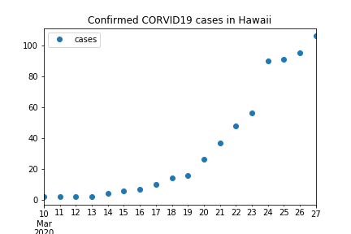
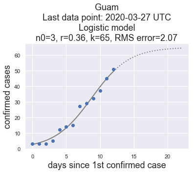
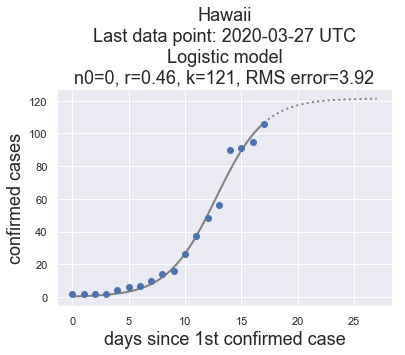

# Guam-Corona-Virus-Data

This repo contains a Jupyter Notebook, [guam-corona-virus-data.ipynb](guam-corona-virus-data.ipynb) which shows how to download Guam corona virus data froma Johns Hopkins GitHub repo. The data were used to generate the following plots.

Data: [Guam.csv](Guam.csv)

Data: [Hawaii.csv](Hawaii.csv)

## Fitting Models to the Data

This repo contains a Jupyter notebook, [curve-fitting.ipynb](curve-fitting.ipynb), which fits curves to the time series (Guam.csv and Hawaii.csv)
using the following models.

* linear
* exponential
* quadratic
* logistic

Results are stored as plots in the images folder. Here are the latest plots for the logistic model:

