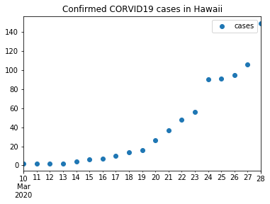

# Guam-Corona-Virus-Data

This repo contains a [Jupyter Notebook](guam-corona-virus-data.ipynb) which shows how to download Guam corona virus data from
a Johns Hopkins GitHub repo. The data were used to generate the following plots.

Data: [Guam.csv](Guam.csv)

Data: [Hawaii.csv](Hawaii.csv)
