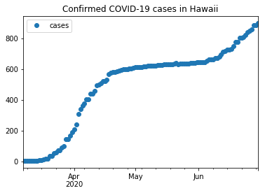
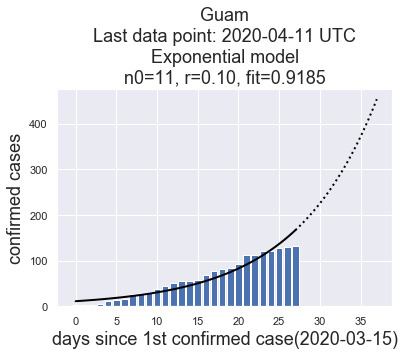
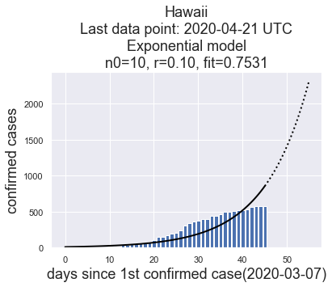

# Guam-Corona-Virus-Data

This repo is intended to facilitate access to Guam CORVID-19 data. Please visit the GitHub.io web page at https://aubreymoore.github.io/Guam-Corona-Virus-Data/.

For a nontechnical description of what I am trying to do, please see my Medium blog post entitled [Fitting Curves to COVID-19 Data from Guam and Hawaii](https://medium.com/@aubreymoore2013/fitting-curves-to-covid-19-data-from-guam-and-hawaii-4c6c116645c4?source=friends_link&sk=d2cda0c27ed44c6ec7c779a9bbbba00e).

Data and images in this repo are automatically updated daily at 11:15 AM ChST (UTC+10) and simple models are automatically fitted.

## Raw Data

This repo contains a Jupyter Notebook, [guam-corona-virus-data.ipynb](guam-corona-virus-data.ipynb) which shows how to download Guam corona virus data from a [Johns Hopkins GitHub repo](https://github.com/CSSEGISandData/COVID-19). If you are just looking for an up-to-date time series of conirmed cases for Guam or Hawaii, just download [Guam.csv](Guam.csv) or [Hawaii.csv](Hawaii.csv). These files were used to generate these plots of the raw data:

Note: Many confirmed cases of US military personnel on Guam are not included in the data. 

## Fitting Models to the Data

This repo contains a Jupyter notebook, [curve-fitting.ipynb](curve-fitting.ipynb), which fits curves to the time series [Guam.csv](Guam.csv) and [Hawaii.csv](Hawaii.csv) using the following models.

* linear
* exponential
* logistic

Results are stored as plots in the images folder. Here are the most recent plots:

