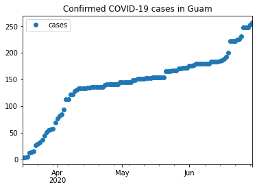
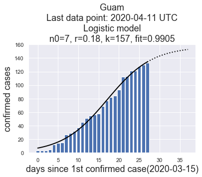
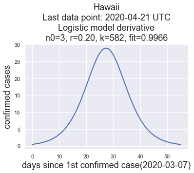
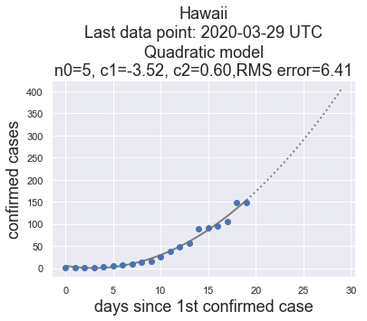
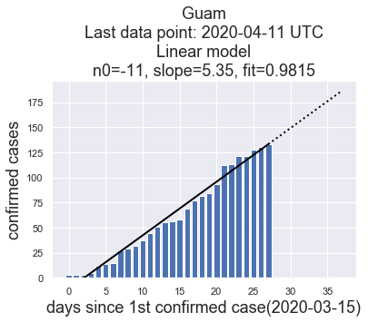

# Guam-Corona-Virus-Data

Automatic updates to the data and images in this repo will be made daily.

This repo contains a Jupyter Notebook, [guam-corona-virus-data.ipynb](guam-corona-virus-data.ipynb) which shows how to download Guam corona virus data from a [Johns Hopkins GitHub repo](https://github.com/CSSEGISandData/COVID-19). If you are just looking for an up-to-date time series of conirmed cases for Guam or Hawaii, just download [Guam.csv](Guam.csv) or [Hawaii.csv](Hawaii.csv). These files were used to generate these plots of the raw data:

## Fitting Models to the Data

This repo contains a Jupyter notebook, [curve-fitting.ipynb](curve-fitting.ipynb), which fits curves to the time series (Guam.csv and Hawaii.csv)
using the following models.

* linear
* exponential
* quadratic
* logistic

Results are stored as plots in the images folder. Here are the most recent plots:

